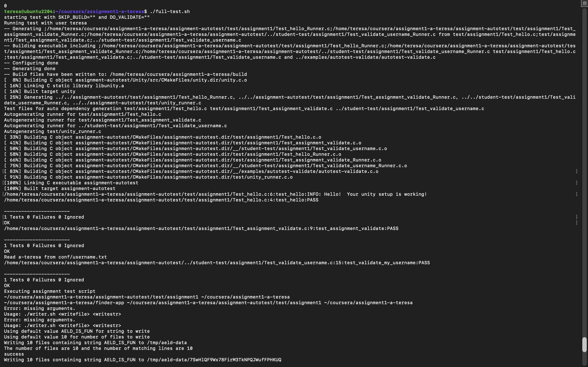

# Assignment 1 – Advanced Embedded Software Development (ECEN-5713)

This repository contains my solution for **Assignment 1** of the  
**Advanced Embedded Software Development (ECEN-5713)** course  
at the **University of Colorado Boulder**.

## Repository Structure

- `finder-app/` – Shell scripts (`finder.sh`, `writer.sh`)
- `conf/` – Configuration files (including `username.txt`)
- `examples/` – Example source code
- `student-test/` – Student unit tests
- `assignment-autotest/` – Automated grading tests (provided)
- `unit-test.sh` – Unit test runner
- `full-test.sh` – Full assignment test runner

## Testing

All required tests for Assignment 1 were executed successfully using the
provided automated test framework.

The following tests passed:
- Unit tests
- Shell script validation (`finder.sh`, `writer.sh`)
- Full assignment integration tests

### Test Results

The screenshot below shows the successful execution of all Assignment 1 tests:

## Notes

- Error messages printed during testing (e.g., missing argument checks) are expected
  and required by the assignment specification.
- All scripts exit with the correct return codes as verified by the test framework.
